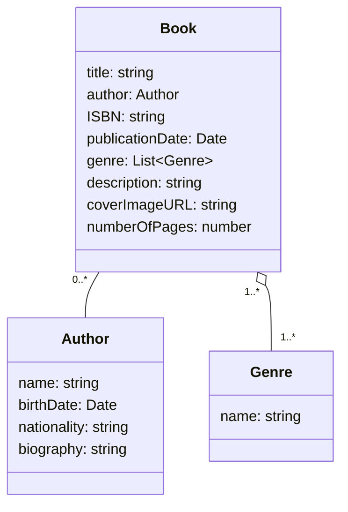

# Class Diagram

```mermaid
classDiagram
    class Book {
        title: string
        author: Author
        ISBN: string
        publicationDate: Date
        genre: List~Genre~
        description: string
        coverImageURL: string
        numberOfPages: number
    }

    class Author {
        name: string
        birthDate: Date
        nationality: string
        biography: string
    }

    class Genre {
        name: string
    }

    Book "0..*" -- Author
    Book "1..*" o-- "1..*" Genre

```