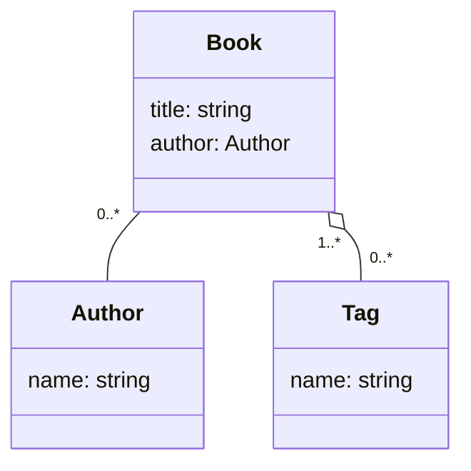

# Class Diagram

```mermaid
classDiagram
    class Book {
        title: string
        author: Author
    }
    
    class Author {
        name: string    
    }
    
    class Tag {
        name: string
    }

    Book "0..*" -- Author
    Book "1..*" o-- "0..*" Tag
```